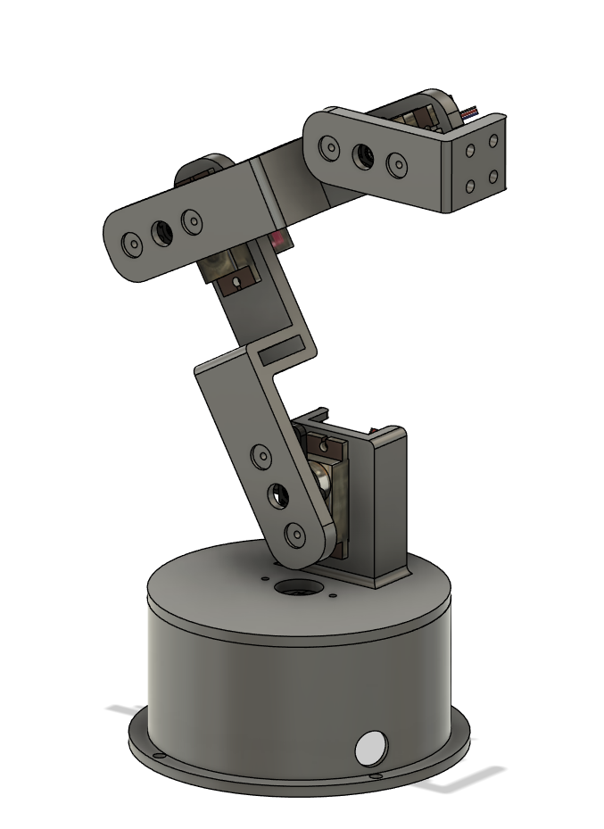

# JDcobot 100
<p align="center">
    
</p>

The JDcobot 100 is a simple manipulator that uses Arduino and four MG90S servos.  
You can use a computer to move the motors to desired angles through the serial port.  
The JDcobot 100 SDK provides a platform for development of custom applications for the JDcobot 100.  
This repository contains files for use of the JDcobot 100 SDK.


## How to use JDcobot 100?

### H/W
1. assembly
   
### S/W
1. Download [jdcobot 100 repository](https://github.com/JoSangYeon0709/jdcobot100/archive/refs/heads/main.zip) and unzip it
2. Install the [Arduino IDE](https://www.arduino.cc/en/software) appropriate for your computer
3. Please upload this arduino_code/ jdcobot_100.ino to Arduino
4. Proceed with the code step by step in python_code/step_by_step_code.
   
! Please do not open the serial monitor in the Arduino IDE. !


## Code & Tickets
||URI|
|-----------------|-----------------------------------------------------------------------------------------|
| Documentatioadn | URL                                                                                     |
| Issues          | https://github.com/JoSangYeon0709/jdcobot100/issues |


## JDcobot100 Repository Overview
```
├── assets                                    Images, photos, and assembly manual of JDcobot 100
├── arduino_code                              JDcobot 100 arduino code
└── python_code                               JDcobot 100 python code
   └── robot_UI_reference_code                UI reference code for jdcobot 100 robot using tkinter
   └── robot_sequxnce_move_example            jdcobot 100 sequence move example code
   └── sample_URDF                            robot URDF file sample
   └── step_by_step_code                      code with added functions step by step to move JDcobot 100
```


## Other JDcobot 100 Repositories
|                         |URI                                                                                      |
|-------------------------|-----------------------------------------------------------------------------------------|
| jdcobot_100_description | [https://github.com/JoSangYeon0709/jdcobot_100_description](https://github.com/JoSangYeon0709/jdcobot_100_description) |
